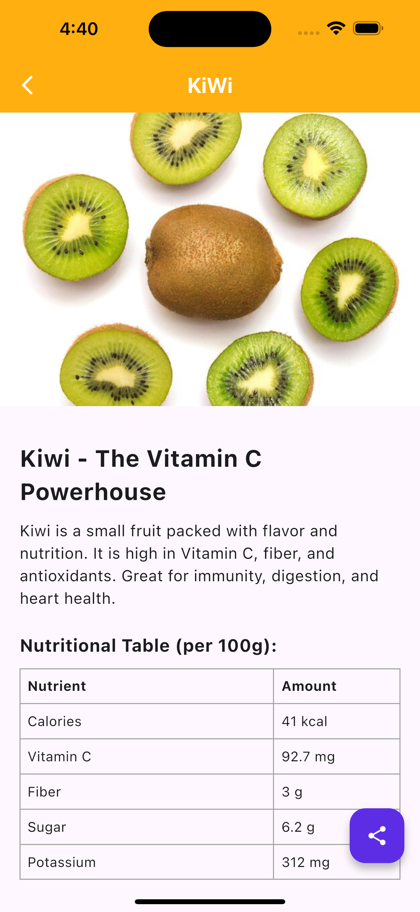
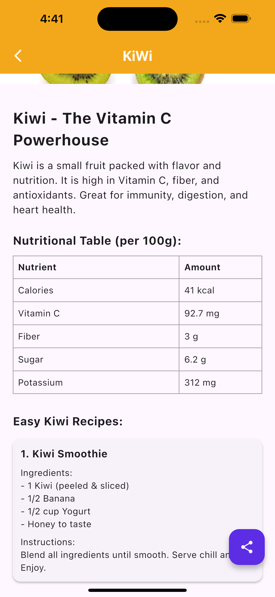
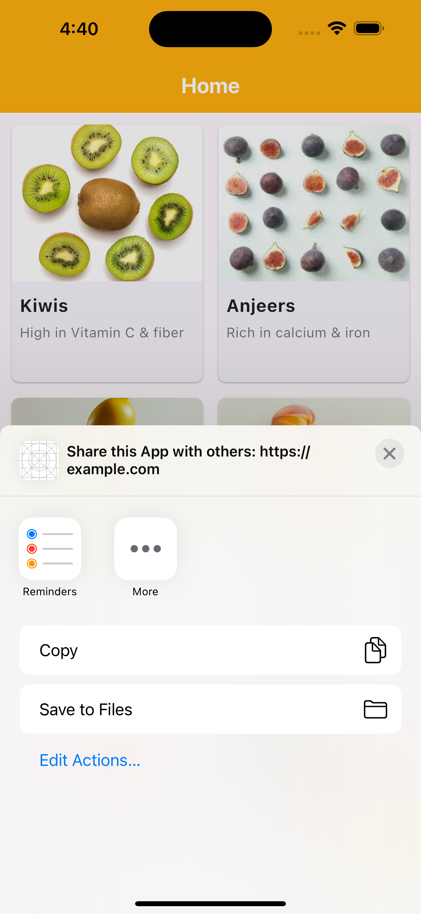

# PhalGyaan – A Friendly Fruit Learning App (Flutter)

PhalGyaan (फलज्ञान) is a simple and beautiful app built using **Flutter & Dart**.  
It helps users learn about different fruits, their nutritional values, health benefits, and quick recipes.  
Designed to be clean, fast, and easy to use.

---

## Features

### Explore Fruits
- Clean grid layout
- Fruit cards with image, name, and short benefits
- Smooth scrolling and responsive design

### Detailed Fruit Information
- Full fruit description
- Health benefits
- Nutritional Table (per 100g)
- Fruit-based recipe ideas

### Share Feature
- Share fruit details or app link using Flutter’s share functionality

### Smooth UI/UX
- Bright and friendly color theme
- Rounded cards and modern layout
- Easy to read typography

---

## Demo Video
(video link here)

---

## Screenshots

| Home Screen | Fruit Grid | Details Screen |
|-------------|------------|----------------|
|  |  |  |

| Nutrition Table | Recipes | Share Sheet |
|------------------|---------|-------------|
|  | 

---

## Tech Stack
- Flutter  
- Dart  
- Material UI components  
- ResponsiveLayouts  
- Share Plus (or your chosen share package)

---

## How to Run

1. Clone the project:
   ```bash
   https://github.com/Balmukund-Maurya/PhalGyaan.git

2. Navigate to the project directory
   ```bash
  cd PhalGyaan

3. Install the required dependencies
   ```bash
   flutter pub get

4. Run the app
   ```bash
   flutter run